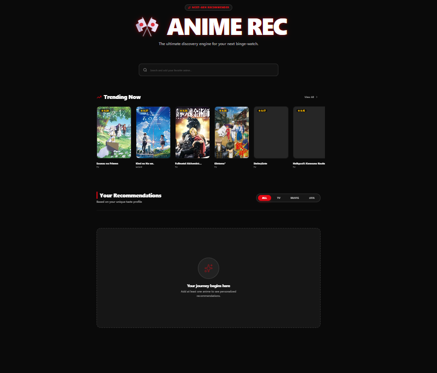
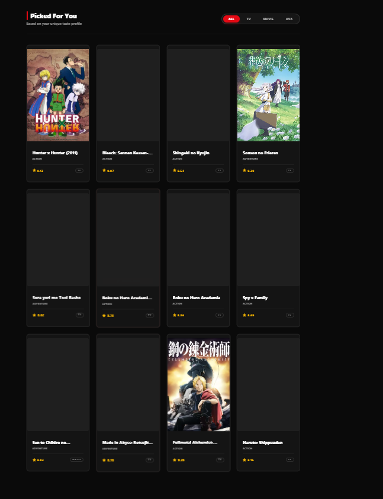
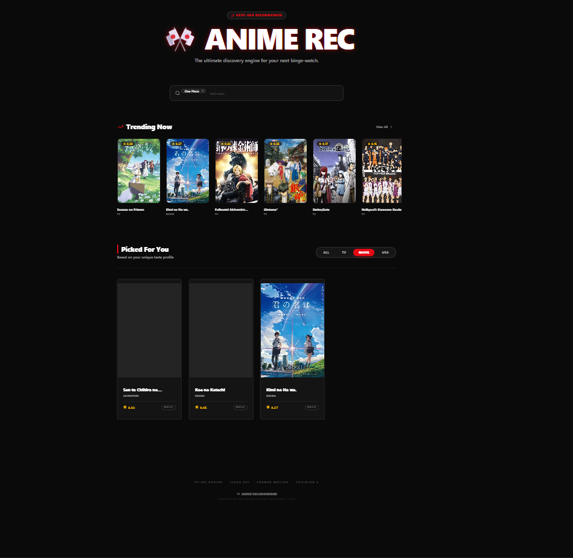
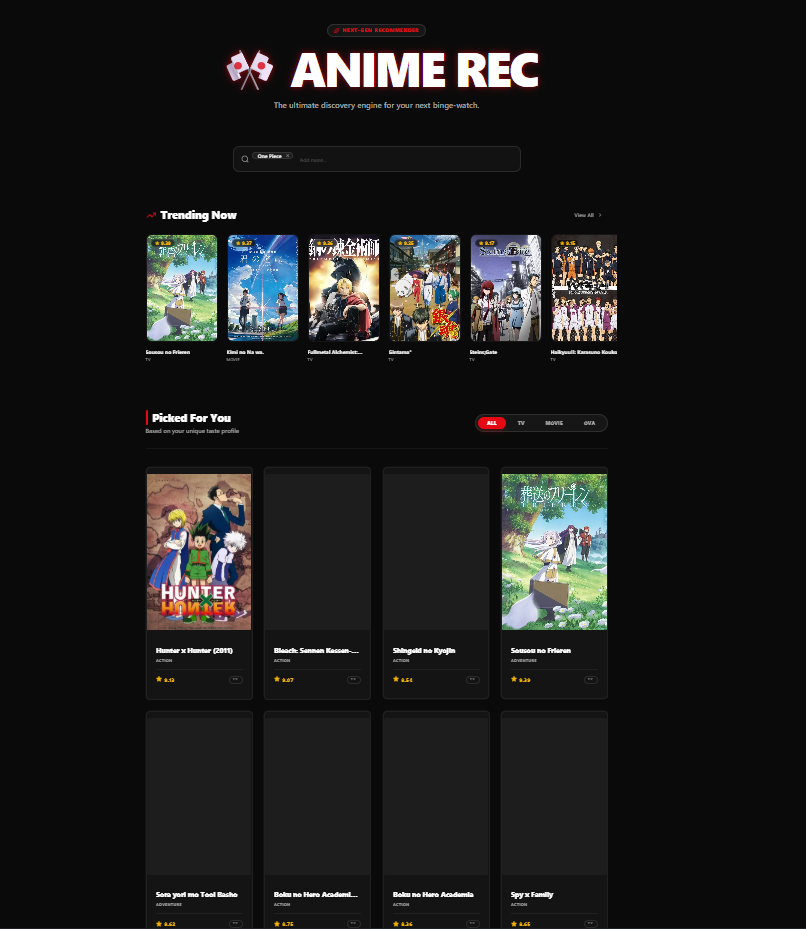

# 🎌 Anime Recommendation System

A modern Anime Recommendation Web Application with a premium OTT-style UI, built using Machine Learning concepts and a React-based frontend.

This system helps users discover new anime based on their preferences using content-based filtering techniques.

---

## 🚀 Features

- 🔍 Smart search-based anime input  
- 🎯 Content-based recommendation system (TF-IDF + Cosine Similarity)  
- 🎴 Anime posters fetched using Jikan API  
- 🎨 Modern UI inspired by Netflix / AnimeRec platforms  
- ⭐ Ratings display for each anime  
- 🔥 Trending anime section  
- 🎯 Personalized recommendations ("Picked For You")  
- 🎛️ Filter options (TV, Movie, OVA)  

---

## 📸 Project Preview

### 🖥️ Main Interface


---

### 🔥 Trending Anime Section


---

### 🎯 Personalized Recommendations


---

### 🎬 Filtered Results View


---

## 🧠 Tech Stack

### Frontend
- React (Vite)  
- Tailwind CSS  

### Machine Learning Concept
- TF-IDF Vectorization  
- Cosine Similarity  

### Data Source
- Jikan API (MyAnimeList)  

---

## ⚙️ Installation & Setup

### 1. Clone the repository

```bash
git clone https://github.com/YashGadhave7890/Anime-Recommendation-System.git
cd Anime-Recommendation-System
