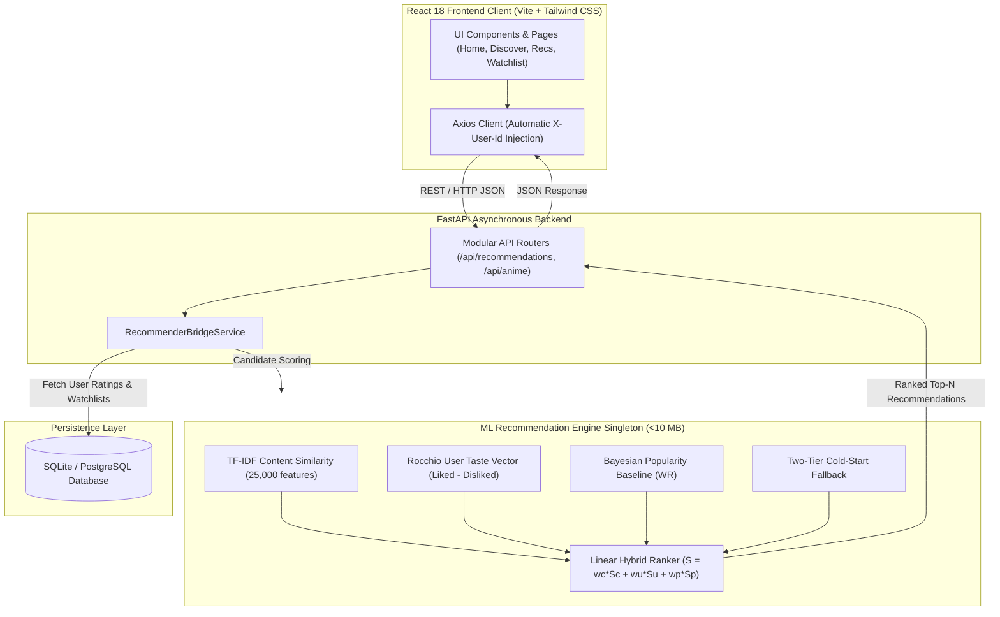

# ANIMORA — System Architecture & Data Flow

This document details the complete end-to-end technical architecture, component interactions, mathematical recommendation models, database entity relationships, and request lifecycle for the **ANIMORA** platform.

---

## 1. High-Level Architecture Diagram

```
┌─────────────────────────────────────────────────────────────────────────────────────────────┐
│                                    ANIMORA System Architecture                              │
└─────────────────────────────────────────────────────────────────────────────────────────────┘

                                    ┌─────────────────────┐
                                    │     User / Client   │
                                    └──────────┬──────────┘
                                               │
                                               │ HTTPS / UI Actions
                                               ▼
     ┌──────────────────────────────────────────────────────────────────────────────────┐
     │                             React 18 Frontend Client                             │
     │                      (Vite + Tailwind CSS + React Router)                        │
     ├──────────────────────────────────────────────────────────────────────────────────┤
     │  • Pages: Home, Discover, Anime Details, Recommendations (ML), Watchlist, Profile│
     │  • State: UserContext (Active persona: Demo User vs Cold-Start User)             │
     │  • Centralized API Service: Axios Client with automatic X-User-Id injection      │
     └─────────────────────────────────────────┬────────────────────────────────────────┘
                                               │
                                               │ RESTful API Calls (JSON over HTTP)
                                               ▼
     ┌──────────────────────────────────────────────────────────────────────────────────┐
     │                           FastAPI Application Layer                              │
     ├──────────────────────────────────────────────────────────────────────────────────┤
     │  • CORS Middleware (Dynamic origins from CORS_ORIGINS environment variable)       │
     │  • Pydantic v2 Validation Schemas (Strict request/response serialization)        │
     │  • Dependency Injection (get_db session, get_current_user persona resolver)      │
     │  • Modular Routers:                                                              │
     │      /health, /api/anime, /api/recommendations, /api/ratings,                    │
     │      /api/watchlist, /api/history, /api/preferences                              │
     └──────────────────────┬───────────────────────────────────┬───────────────────────┘
                            │                                   │
              SQLAlchemy ORM│Queries                            │Bridge Facade (In-Memory)
                            ▼                                   ▼
     ┌───────────────────────────────────┐    ┌─────────────────────────────────────────┐
     │        SQLite / PostgreSQL        │    │    ML Recommendation Engine Singleton   │
     │            Database               │    │   (Precomputed Sparse Artifacts <10 MB) │
     ├───────────────────────────────────┤    ├─────────────────────────────────────────┤
     │ • anime_references (17,495 rows)  │    │ • content_recommender.py (TF-IDF Cosine)│
     │ • users (Demo profiles 1 & 2)     │    │ • user_profile.py (Rocchio Taste Vector)│
     │ • ratings (Scores 1.0 - 10.0)     │    │ • popularity_recommender.py (Bayesian WR│
     │ • watchlist (Status bookmarks)    │    │ • hybrid_recommender.py (Linear Blend)  │
     │ • watch_history (Episode progress)│    │ • cold_start.py (Tier 1 & 2 Fallback)   │
     │ • user_preferences (Genres/Types) │    │ • models/ (Sparse CSR Matrix + Index)   │
     └───────────────────────────────────┘    └────────────────────┬────────────────────┘
                                                                   │
                                                                   ▼
                                              ┌─────────────────────────────────────────┐
                                              │         Recommendation Response         │
                                              │  (Ranked items, scores, source strategy)│
                                              └─────────────────────────────────────────┘
```

### Mermaid Architecture Diagram



---

## 2. End-to-End Data Flow

```
[1] Client Request: GET /api/recommendations/personalized?top_n=10 (Header: X-User-Id: 1)
        │
        ▼
[2] FastAPI RecommenderBridgeService retrieves user interaction history:
    ├── Ratings: Fetches user ratings (liked titles >= 7.0, disliked <= 5.0)
    ├── Watchlist: Fetches anime marked as 'watching', 'completed', or 'dropped' to exclude
    └── Preferences: Fetches explicitly chosen preferred genres & format types
        │
        ▼
[3] Decision Tree Routing:
    ├── Path A: User has Ratings?
    │     ├── Construct Rocchio profile vector: V_user = α * Mean(V_liked) - β * Mean(V_disliked)
    │     ├── Evaluate dot product similarity against all 17,495 candidate vectors
    │     ├── Blend with Bayesian popularity scores: S_hybrid = (0.7 * S_user) + (0.3 * S_pop)
    │     ├── Strictly exclude rated IDs, watched IDs, and query anime
    │     └── Return strategy="personalized"
    │
    ├── Path B: User has NO Ratings, but has Preferred Genres? (Cold-Start Tier 1)
    │     ├── Calculate genre token overlap across catalog titles
    │     ├── Blend 60% genre overlap + 40% Bayesian quality baseline
    │     ├── Exclude any watched IDs
    │     └── Return strategy="cold_start_genre_conditioned"
    │
    └── Path C: User has ZERO History & ZERO Preferences? (Cold-Start Tier 2)
          ├── Select top-ranked Bayesian quality titles
          ├── Enforce primary genre diversity (max 2 per primary genre)
          └── Return strategy="cold_start_global_diverse"
        │
        ▼
[4] Response Serialized via Pydantic RecommendationResponse and returned to React client.
```

---

## 3. Machine Learning Recommendation Models

### Model 1: TF-IDF Content-Based Recommender
* **Input Feature**: Multi-modal `content_soup` combining:
  $$\text{soup} = \text{title} + \text{genres} + \text{type} + \text{studios} + \text{source} + \text{synopsis}$$
* **Vectorization**: Scikit-Learn `TfidfVectorizer` (sublinear term frequencies, max 25,000 unigram/bigram tokens, English stopword removal).
* **Distance Metric**: Cosine dot product over $L_2$-normalized sparse TF-IDF vectors:
  $$\text{Sim}(q, c) = \mathbf{v}_q \cdot \mathbf{v}_c$$
* **Latency**: Query execution executes in $\approx 5\text{ ms}$ over 17,495 titles.

### Model 2: Bayesian Regularized Quality & Popularity Baseline
* Avoids the small-sample bias problem where anime with 3 votes of 10.0 outrank classics with 2,000,000 votes of 9.0:
  $$WR = \frac{v}{v + m} R + \frac{m}{v + m} C$$
  where:
  - $R$: Raw community score (1.0–10.0)
  - $v$: Number of community ratings/members
  - $m$: 80th-percentile minimum threshold ($m = 41,106$)
  - $C$: Global mean score across rated catalog ($C = 6.51$)
* **Log Popularity Transformation**: Log-transforms member counts to normalize variance across 6 orders of magnitude:
  $$\text{pop\_norm} = \frac{\ln(1 + v) - \min}{\max - \min}$$

### Model 3: Rocchio User Taste Vector
* Represents user preferences in the continuous 25,000-dimensional TF-IDF space:
  $$\mathbf{u} = \alpha \frac{1}{|P|} \sum_{i \in P} \mathbf{v}_i - \beta \frac{1}{|N|} \sum_{j \in N} \mathbf{v}_j$$
  where $P$ denotes liked titles (rating $\ge 7.0$), $N$ denotes disliked titles (rating $\le 5.0$), $\alpha = 1.0$, and $\beta = 0.3$.
* Clamped at 0 to prevent negative term frequencies and re-normalized to $\|\mathbf{u}\|_2 = 1.0$.

### Model 4: Configurable Hybrid Linear Ranker
* Linearly blends three distinct signals with user-tunable weights:
  $$S_{\text{hybrid}} = w_{\text{content}} S_{\text{content}} + w_{\text{user}} S_{\text{user}} + w_{\text{pop}} S_{\text{pop}}$$
  normalized such that $w_{\text{content}} + w_{\text{user}} + w_{\text{pop}} = 1.0$.

---

## 4. Database Schema (Entity Relationships)

```
┌───────────────────────────┐
│     anime_references      │
├───────────────────────────┤
│ PK  mal_id        (INT)   │
│     name          (TEXT)  │
│     english_name  (TEXT)  │
│     score         (FLOAT) │
│     weighted_score(FLOAT) │
│     genres        (TEXT)  │
│     type          (TEXT)  │
│     episodes      (FLOAT) │
│     members       (INT)   │
│     release_year  (INT)   │
│     synopsis      (TEXT)  │
│     img_url       (TEXT)  │
└─────────────┬─────────────┘
              │
              │ 1:N
     ┌────────┴────────┬─────────────────────┬──────────────────┐
     │                 │                     │                  │
     ▼                 ▼                     ▼                  ▼
┌──────────────┐ ┌───────────────┐ ┌───────────────────┐ ┌───────────────┐
│   ratings    │ │   watchlist   │ │   watch_history   │ │user_preference│
├──────────────┤ ├───────────────┤ ├───────────────────┤ ├───────────────┤
│ PK id        │ │ PK id         │ │ PK id             │ │ PK id         │
│ FK user_id   │ │ FK user_id    │ │ FK user_id        │ │ FK user_id    │
│ FK anime_id  │ │ FK anime_id   │ │ FK anime_id       │ │ preferred_gnr │
│    rating    │ │    status     │ │ progress_episodes │ │ preferred_typ │
│    review    │ │    created_at │ │    watched_at     │ │ updated_at    │
└──────┬───────┘ └───────┬───────┘ └─────────┬─────────┘ └───────┬───────┘
       │                 │                   │                   │
       └─────────────────┴─────────┬─────────┴───────────────────┘
                                   │ N:1
                                   ▼
                         ┌───────────────────┐
                         │       users       │
                         ├───────────────────┤
                         │ PK id       (INT) │
                         │    username (TEXT)│
                         │    display_name   │
                         │    created_at     │
                         └───────────────────┘
```
