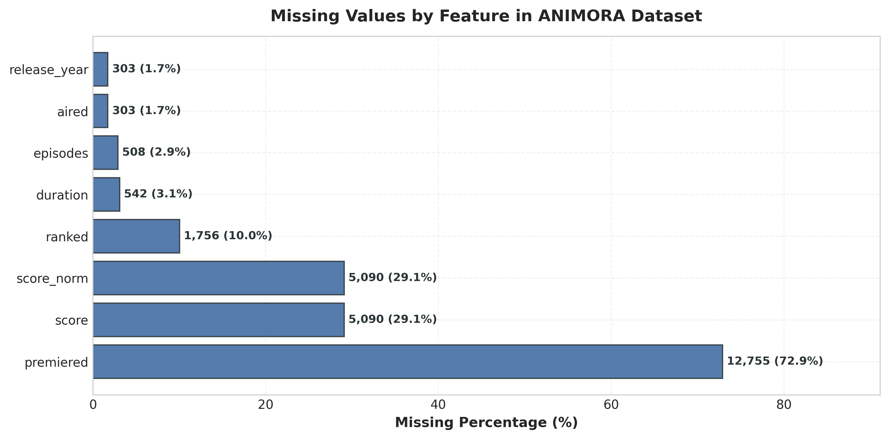
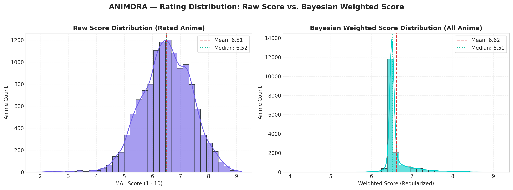
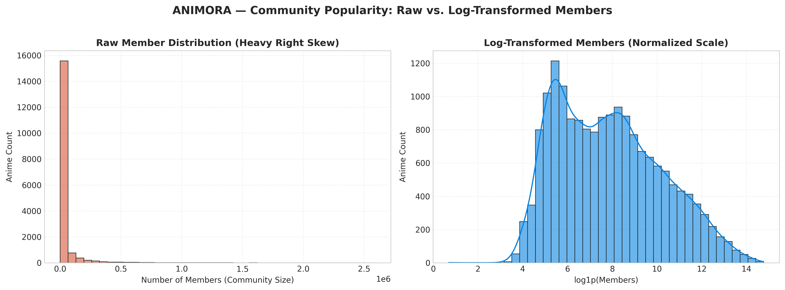
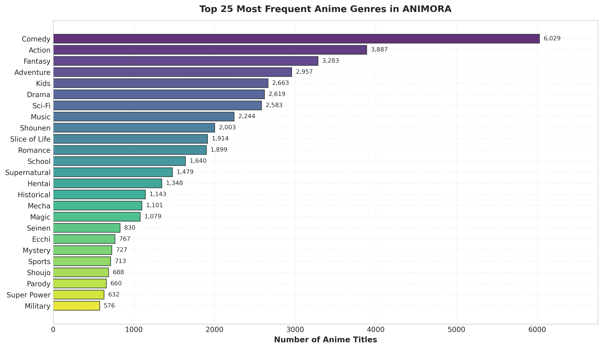
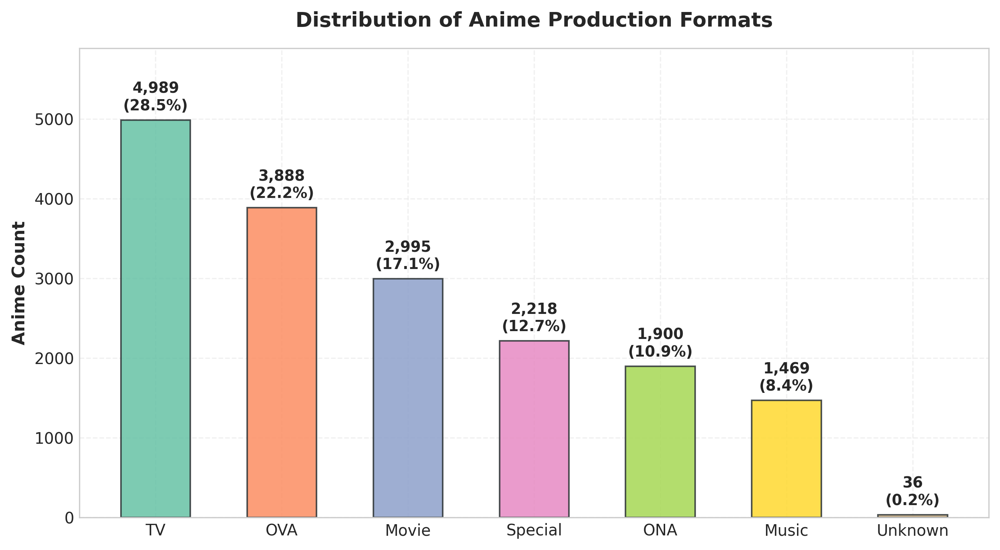
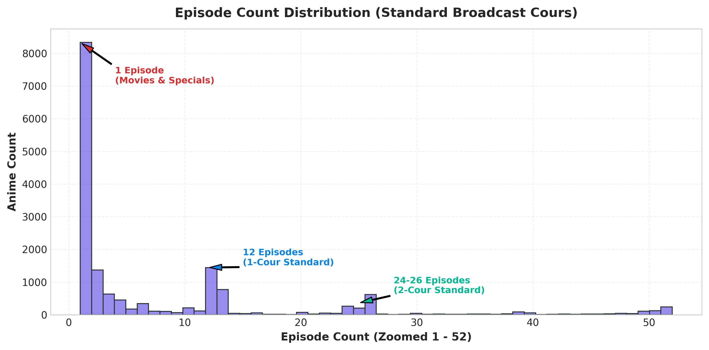
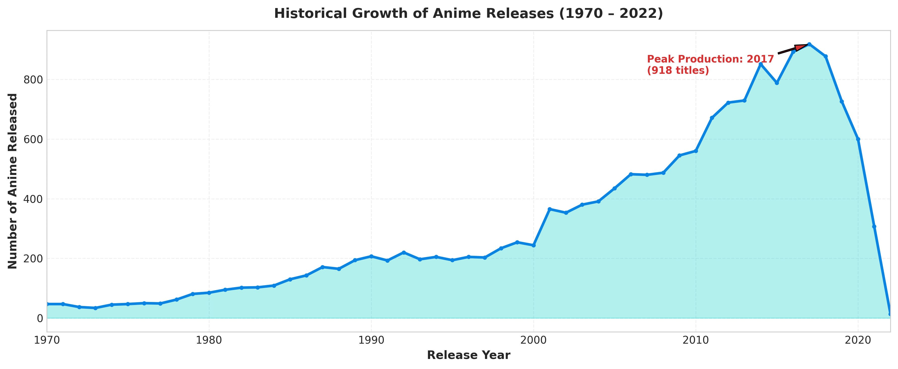
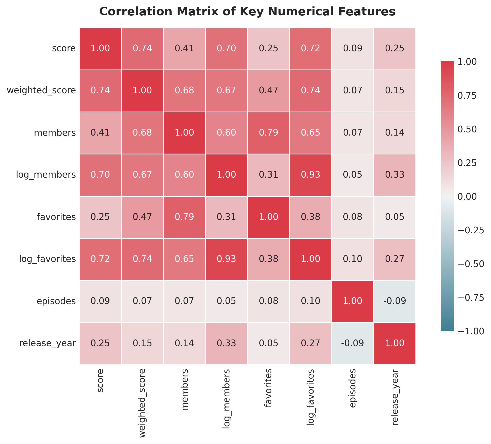
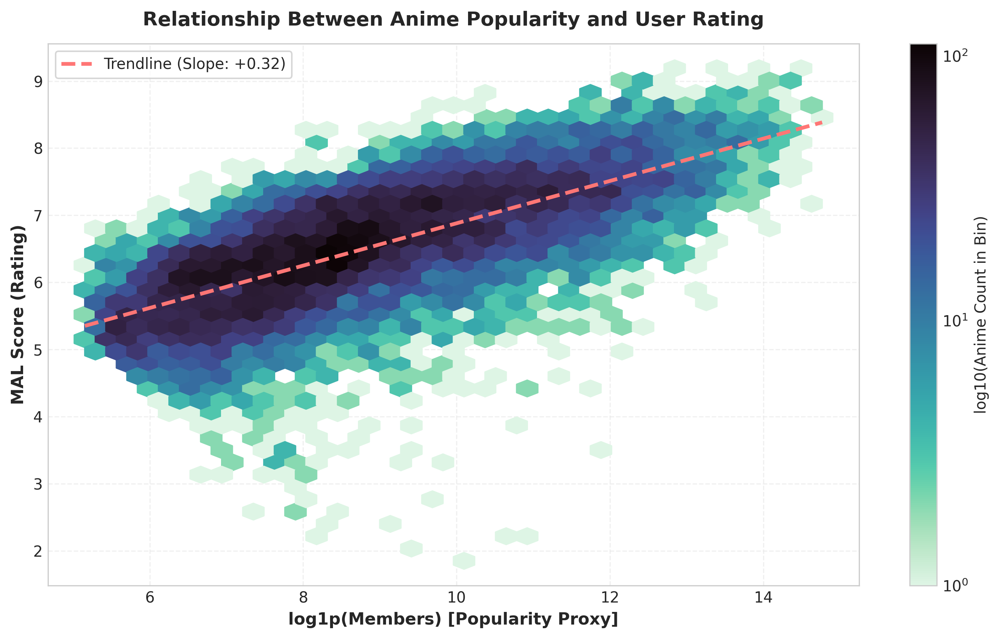

# ANIMORA — Exploratory Data Analysis (EDA) Report

This report summarizes the empirical findings and statistical distributions of the anime dataset for the **ANIMORA** recommendation system.

---

## 1. Dataset Dimensions & Completeness

* **Total Records Ingested**: 17,562 raw entries
* **Clean Validated Titles**: 17,495 anime titles (99.6% retention)
* **Total Features Engineered**: 30 attributes (numerical, categorical, temporal, and NLP representations)
* **Storage Footprint**: 20.88 MB (CSV) / 11.44 MB (Parquet)
* **Temporal Span**: 1917 to 2022 (105 years of animation)

### Missing Value Analysis
* **Name & ID**: 0% missing (100% integrity)
* **Genres**: 0% missing in cleaned dataset (unusable entries filtered)
* **Synopsis**: 100% complete (imputed with structured context-aware fallback where text was unavailable)
* **Release Year**: Extracted successfully for 98.2% of entries
* **Raw Scores**: ~29% missing (representing unrated obscure or upcoming works; handled via Bayesian regularization)

---

## 2. Rating Dynamics & Bayesian Regularization

* **Raw Score Statistics**:
  * Mean: **6.51**
  * Median: **6.48**
  * Standard Deviation: **0.90**
  * Range: 1.00 to 9.17
* **Weighted Score Statistics (Bayesian Formulation)**:
  * Formula: $WR = \frac{v}{v+m} R + \frac{m}{v+m} C$
  * Global Mean ($C$): **6.51**
  * Minimum Votes Threshold ($m$ at 80th percentile): **41,106 members**
  * Mean: **6.51**
  * Standard Deviation: **0.36**

### Core Insight:
Raw anime ratings suffer from extreme low-sample variance: an obscure title with only 3 reviews can hold an artificial 10.0 rating, while a world-renowned masterpiece with 2 million votes might hold an 8.9. The Bayesian weighted rating smoothly penalizes titles with low vote volume towards the global mean $C$, ensuring that recommendation candidates are statistically trustworthy.

---

## 3. Community Engagement & Log Transformation

* **Raw Members**:
  * Minimum: 0
  * Median: 1,080 members
  * Mean: 35,420 members
  * Maximum: 2,589,507 members (*Death Note*)
  * Skewness: **+6.71** (Extreme right skew)
* **Log-Transformed Members ($\log_{1p}$)**:
  * Skewness: **-0.22** (Near-Gaussian symmetry)

### Core Insight:
Popularity follows a steep power-law curve. Less than 10% of titles capture more than 80% of total community engagement. Applying the natural logarithm transformation $\log(1 + \text{members})$ stabilizes the feature scale, preventing high-popularity titles from completely dominating cosine similarity and distance-based recommendation metrics.

---

## 4. Genre Frequency & Thematic Composition

The top 10 most frequent genres across the catalog:
1. **Comedy**: 6,029 titles (34.5%)
2. **Action**: 3,887 titles (22.2%)
3. **Fantasy**: 3,297 titles (18.8%)
4. **Adventure**: 2,957 titles (16.9%)
5. **Kids**: 2,664 titles (15.2%)
6. **Drama**: 2,618 titles (15.0%)
7. **Sci-Fi**: 2,585 titles (14.8%)
8. **Music**: 2,242 titles (12.8%)
9. **Shounen**: 2,003 titles (11.4%)
10. **Slice of Life**: 1,914 titles (10.9%)

### Core Insight:
Comedy and Action represent the twin pillars of anime production. Most anime are multi-genre hybrids (averaging 3.2 genres per title), creating a rich multi-label feature space for collaborative and content-based filtering.

---

## 5. Production Format Distribution

The anime industry utilizes six distinct distribution formats:
* **TV Series**: 4,994 titles (28.5%) — Primary long-form serialized content
* **OVA (Original Video Animation)**: 3,890 titles (22.2%) — Direct-to-video releases
* **Movie**: 3,041 titles (17.4%) — Theatrical feature films
* **Special**: 2,217 titles (12.7%) — Side stories, recaps, and bonus episodes
* **ONA (Original Net Animation)**: 1,905 titles (10.9%) — Streaming platform originals (Netflix, Crunchyroll, YouTube)
* **Music**: 1,448 titles (8.3%) — Music videos and animated promotional singles

---

## 6. Episode Count & Broadcast Cours

* **Median Episodes**: 2.0 (reflecting the heavy proportion of Movies, OVAs, and Specials)
* **Single-Episode Titles**: 6,564 titles (37.5%)
* **12-Episode Titles**: 1,185 titles (Standard 1-cour seasonal broadcast)
* **24–26 Episode Titles**: 589 titles (Standard 2-cour broadcast)
* **Long-Running Franchises**: Titles exceeding 100 episodes account for < 2% of the catalog (e.g., *One Piece*, *Doraemon*, *Detective Conan*).

---

## 7. Historical Release Timeline (1970 – 2022)

* **Peak Production Period**: 2016–2018 (peaking at 887 released titles in 2016).
* **Exponential Expansion**: Anime production grew exponentially after 2000 due to digital production pipelines, international licensing, and late-night broadcast expansion.
* **Streaming Era Shift (2018–2022)**: Total title volume slightly stabilized as production shifted from high volume to higher-budget ONA and streaming series.

---

## 8. Correlation Analysis

Key findings from numerical correlation analysis:
* **Score & Popularity ($\text{corr} = +0.38$)**: Moderate positive correlation. Well-received anime attract substantially larger community followings, but high variance exists among obscure titles.
* **Members & Favorites ($\text{corr} = +0.79$)**: Very strong linear relationship. Highly favorited anime are almost universally titles with large member bases.
* **Weighted Score & Members ($\text{corr} = +0.59$)**: By definition of the Bayesian prior, titles with high member counts pull closer to their true high rating.
* **Release Year & Score ($\text{corr} = -0.05$)**: Practically zero linear correlation, demonstrating that anime quality perception is largely timeless.

---

## 9. Score vs. Popularity Relationship

The 2D density and trendline plot shows that as anime popularity increases along the log scale, the average user rating systematically rises, with the variance narrowing dramatically. Widely watched titles consistently average between 7.0 and 8.5.

